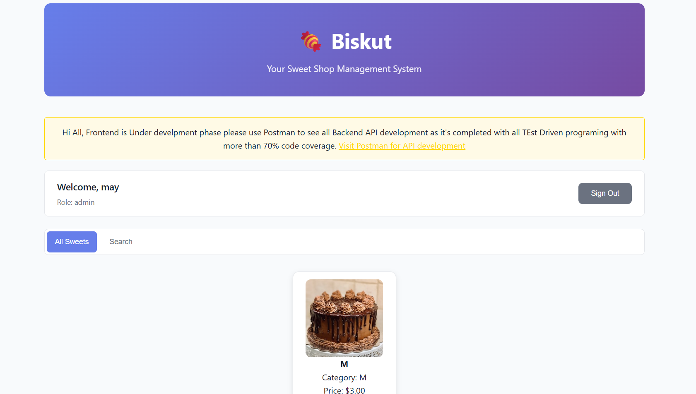

---

# 🍬 Biskut Sweet Shop Management

**Biskut** is a Sweet Shop Management System developed using **Django** for the backend and **HTML, CSS, and JavaScript** for the frontend. It allows **customers** to browse and purchase sweets, while **admins** can manage inventory, create new sweets, and restock existing ones.

---

## Table of Contents

1. [Project Overview](#project-overview)
2. [Features](#features)
3. [Tech Stack](#tech-stack)
4. [Setup Instructions](#setup-instructions)
5. [API Endpoints](#api-endpoints)
6. [Frontend Functionality](#frontend-functionality)
7. [Sample JSON Inputs](#sample-json-inputs)
8. [Screenshots](#screenshots)
9. [Author](#author)

---

## Project Overview

Biskut simplifies sweet shop operations:

* **Customers** can view sweets, make purchases, and check their purchase history.
* **Admins** can create, update, delete, and restock sweets while maintaining inventory logs.
* Tracks **inventory logs** for both purchases and restocks to maintain transparency.

---

## Features

### For Customers

* Login/Register system with email verification.
* Browse all available sweets.
* Purchase sweets with quantity selection and payment method.
* View personalized greeting with username and role.

### For Admins

* Create new sweets in the inventory.
* Update and delete sweets.
* Restock existing sweets.
* Track inventory actions via logs.

### Common

* JWT-based authentication with **access** and **refresh** tokens.
* Clear alert messages for successful or failed actions.

---

## Tech Stack

* **Backend:** Django, Django REST Framework, Simple JWT
* **Frontend:** HTML, CSS, JavaScript (Vanilla)
* **Database:** SQLite (default)
* **Authentication:** JWT (access & refresh tokens)

---

## Setup Instructions

1. Clone the repository:

```bash
git clone <repo_url>
cd Biskut
```

2. Create a virtual environment and activate it:

```bash
python -m venv venv
source venv/bin/activate    # Linux/macOS
venv\Scripts\activate       # Windows
```

3. Install dependencies:

```bash
pip install -r requirements.txt
```

4. Apply migrations:

```bash
python manage.py makemigrations
python manage.py migrate
```

5. Run the development server:

```bash
python manage.py runserver
```

6. Open in browser: `http://127.0.0.1:8000`

---

## API Endpoints

### Authentication

| Method | Endpoint             | Description                                 |
| ------ | -------------------- | ------------------------------------------- |
| POST   | `/api/register/`     | Register a new user                         |
| POST   | `/api/login/`        | Login user, returns access & refresh tokens |
| POST   | `/api/logout/`       | Logout user (frontend clears tokens)        |
| GET    | `/api/current-user/` | Fetch current logged-in user info           |

### Sweets Management

| Method | Endpoint                     | Role          | Description           |
| ------ | ---------------------------- | ------------- | --------------------- |
| GET    | `/api/sweets/`               | Authenticated | List all sweets       |
| POST   | `/api/sweets/create/`        | Admin         | Create a new sweet    |
| PUT    | `/api/sweets/<id>/update/`   | Admin         | Update existing sweet |
| DELETE | `/api/sweets/<id>/delete/`   | Admin         | Delete sweet          |
| GET    | `/api/sweets/search/`        | Authenticated | Search sweets         |
| POST   | `/api/sweets/<id>/purchase/` | Customer      | Purchase a sweet      |
| POST   | `/inventory/<id>/restock/`   | Admin         | Restock sweet         |

---

## Frontend Functionality

* **Login/Register:** Toggle between login and registration forms.
* **Dashboard:** Displays personalized greeting and role of logged-in user.
* **All Sweets:** Shows sweets grid with name, category, price, quantity, and actions.
* **Customer Actions:** Purchase sweets via modal with quantity & payment method.
* **Admin Actions:** Create, update, delete, and restock sweets with inline input.
* **Alerts:** Success or error alerts are displayed on all actions.

---

## Sample JSON Inputs

### Create Sweet (Admin)

```json
{
    "name": "Bisk",
    "category": "Sweet",
    "price": 222.20,
    "quantity": 2
}
```

### Restock Sweet (Admin)

```json
{
    "quantity": 9
}
```

### Purchase Sweet (Customer)

```json
{
    "quantity": 2
}
```

**Response Example:**

```json
{
    "message": "Purchased 2 x M",
    "total_price": 6.0,
    "current_quantity": 3
}
```

---

## Screenshots



---

## Author

**Mayur Gohil**
Email: [mayur@example.com](mailto:mayur@example.com)

---

